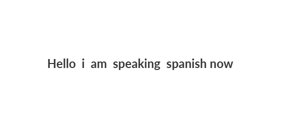
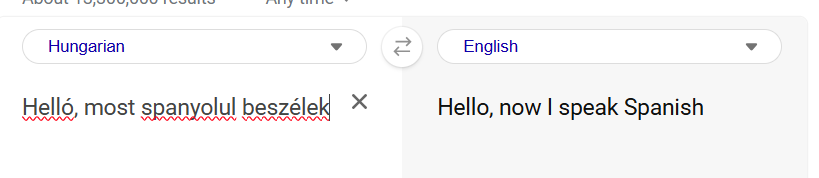
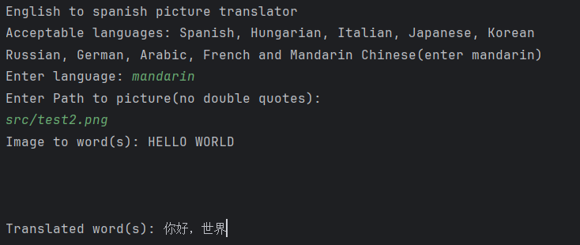
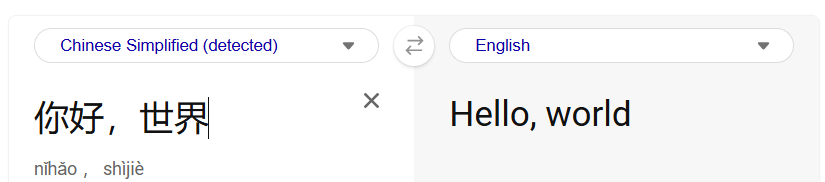
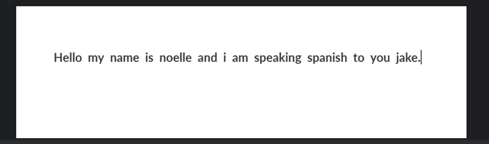
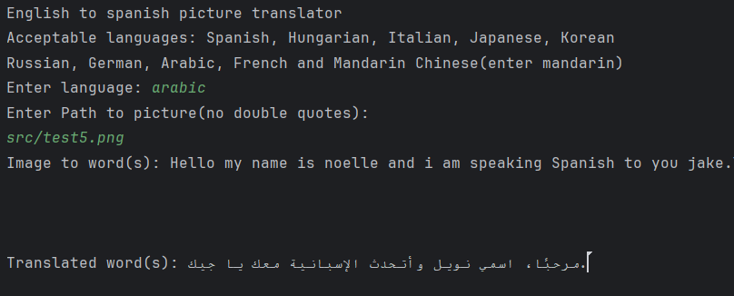
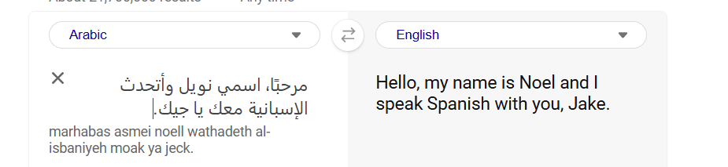

# Overview
This project showcases the integration of OCR technology and external translation APIs to automate the translation process from images. 
It demonstrates practical use cases for machine learning libraries (like Tesseract for OCR) and API integration for language processing, which permits efficient communication across language barriers.
This program implements an automated translation tool that converts text extracted from images into various languages. 
The core functionalities include optical character recognition (OCR) and language translation using external APIs.
# Features 
* Translation API (MyMemory API): Integrated for language translation
* Java programming language: Used for application logic
* Image Text Extraction: Used Tesseract OCR to extract text from images in English
* Error Handling: Implemented error handling to manage API failures and user input errors
# Future Plans
* Add GUI to enhance user experience
* Expand languages
* Android application for ease and every day use
* Add a filtering mode for unclear images(enhance RGB values and make photo overall easier to read in)
# Example Images

